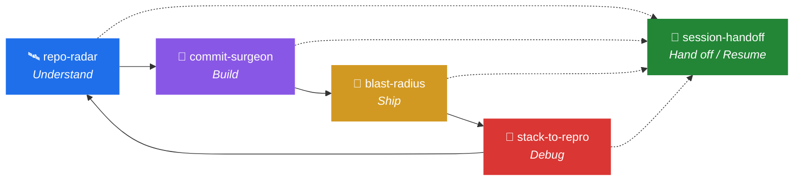

<div align="center">

# 🧩 Dev Lifecycle Skills for Claude

### *Five skills that kill the uncertainty tax on shipping software.*

[](LICENSE)
[](https://www.python.org/)
[](#design-principles)
[](#-dev-lifecycle-skills-for-claude)
[](https://code.claude.com/docs)
[](#license)

🛰️ **Understand** &nbsp;·&nbsp; 🔪 **Build** &nbsp;·&nbsp; 🧭 **Ship** &nbsp;·&nbsp; 🎯 **Debug** &nbsp;·&nbsp; 🤝 **Hand off**

</div>

---

A collection of [Claude Agent Skills](https://code.claude.com/docs) that attack
the *uncertainty* tax on shipping software — the anxious questions between "done
coding" and "safely shipped" that no linter answers. Each skill pairs a
**read-only analysis engine** (pure Python 3 stdlib + `git`, `ripgrep` when
available) with a **workflow** that tells Claude how to act on the output.

Together they cover the full loop:



_At any point in the loop, `session-handoff` can freeze the session — files **and**
accumulated knowledge — so another developer resumes exactly there._

| Stage | Skill | The question it kills |
| ----- | ----- | --------------------- |
| 🛰️ **Understand** | [`repo-radar`](skills/repo-radar) | *"I'm new here — where do I even start?"* |
| 🔪 **Build** | [`commit-surgeon`](skills/commit-surgeon) | *"My working tree is a mess — how do I commit this cleanly?"* |
| 🧭 **Ship** | [`blast-radius`](skills/blast-radius) | *"What does this change break? Did I forget tests/docs?"* |
| 🎯 **Debug** | [`stack-to-repro`](skills/stack-to-repro) | *"Here's a crash — where is it and how do I reproduce it?"* |
| 🤝 **Hand off** | [`session-handoff`](skills/session-handoff) | *"Another dev must resume my session — how do I not lose what we learned?"* |

Each is language-agnostic (Python, JS/TS, Go, Java, Ruby, Rust, PHP, C/C++, C#,
Kotlin, Swift) and never writes to your repo — the engines only read; Claude does
the edits deliberately, guided by what they find.

---

## 🛰️ repo-radar — onboarding autopilot

Drop into any unfamiliar codebase and get an instant guided tour: entry points,
the **core load-bearing modules ranked by reference-centrality × git churn**, the
hottest files, where tests live, and the config that defines the project — in a
suggested reading order. Turns a lost first day into a ten-minute orientation.

```bash
python3 skills/repo-radar/scripts/tour.py --md TOUR.md
```

## 🔪 commit-surgeon — messy tree → atomic commits

You made five unrelated changes in one sitting. This clusters the diff by
concern, infers a Conventional-Commit type and message per group, orders them for
review (`build → refactor → feat → fix → perf → test → docs → ci → style`), and
emits a runnable staging script. Mixed-concern files are flagged for `git add -p`.

```bash
python3 skills/commit-surgeon/scripts/plan_commits.py --md commit-plan.md --sh commit.sh
```

## 🧭 blast-radius — pre-merge impact analyzer

Before you merge, it maps the full blast radius: **who calls what you changed**
(reverse dependencies), which collateral surfaces are touched (tests, docs, API,
migrations, config, i18n), a 0–100 risk score, and an actionable ship-readiness
checklist. Catches the caller outside your diff and the test you forgot.

```bash
python3 skills/blast-radius/scripts/blast_radius.py --base origin/main --md report.md
```

## 🎯 stack-to-repro — crash → failing test

Paste a production/CI stack trace and it locates the **exact culprit frame inside
your repo** (skipping library noise), extracts the failing function, and
scaffolds a minimal red test that reproduces the crash — so you write the fix,
not the archaeology. Supports Python, JS/TS/Node, Java/Kotlin, Ruby, Go, PHP.

```bash
python3 skills/stack-to-repro/scripts/parse_trace.py trace.txt --md repro-brief.md
```

## 🤝 session-handoff — resumable session export

A session's knowledge base is two things: the **mechanical state** (repo
position, uncommitted work, the exact versions of every loaded document —
captured and **content-hashed** by the engine) and the **semantic state**
(decisions, findings, dead ends, next steps — which lives in the conversation
and gets serialized into a rigorous `HANDOFF.md`). The bundle travels as a
directory or a single `handoff-<ts>.tar.gz`; on the other side, `restore`
verifies HEAD and hashes (detecting document drift), re-applies the work in
progress, and hands the new session a ready-made resume prompt.

```bash
# sender
python3 skills/session-handoff/scripts/handoff.py create --kb docs/ --pack
# receiver
python3 skills/session-handoff/scripts/handoff.py restore --bundle handoff-<ts>.tar.gz --apply
```

---

## Layout

```
.
├── README.md
├── LICENSE
├── .gitignore
└── skills/
    ├── repo-radar/
    │   ├── SKILL.md              # when to use it + the workflow Claude follows
    │   ├── scripts/tour.py        # ranking engine (churn × centrality)
    │   └── references/ranking.md
    ├── commit-surgeon/
    │   ├── SKILL.md
    │   └── scripts/plan_commits.py
    ├── blast-radius/
    │   ├── SKILL.md
    │   ├── scripts/blast_radius.py
    │   ├── references/methodology.md
    │   └── examples/example-report.md
    ├── stack-to-repro/
    │   ├── SKILL.md
    │   ├── scripts/parse_trace.py
    │   └── references/trace-formats.md
    └── session-handoff/
        ├── SKILL.md
        └── scripts/handoff.py       # create/restore verifiable handoff bundles
```

Each skill is a self-contained directory: a `SKILL.md` (with YAML frontmatter
Claude uses to decide when to invoke it), a `scripts/` engine, and optional
`references/` and `examples/`.

## Install

Copy any (or all) of the skill directories into your project's or personal skills
folder so Claude Code discovers them:

```bash
# Project-scoped (shared with your team via the repo)
mkdir -p .claude/skills && cp -r skills/* .claude/skills/

# Personal (available in every project)
mkdir -p ~/.claude/skills && cp -r skills/* ~/.claude/skills/
```

Claude loads the right one automatically when a request matches — *"give me a
tour of this repo"*, *"split my changes into clean commits"*, *"what does this
change break?"*, *"reproduce this stack trace"* — or you can run any engine
standalone (they're just Python scripts) and wire them into CI or git hooks.

## Design principles

- **Read-only engines.** Analysis never mutates your repo; Claude makes edits
  deliberately, with the analysis as evidence. The only writes are explicit,
  opt-in apply steps you invoke yourself (`commit.sh`, `handoff.py restore
  --apply`).
- **Zero dependencies.** Python 3 stdlib + `git`. `ripgrep` is used if present,
  with a pure-Python fallback. Nothing to install.
- **Heuristic, honestly.** The engines are fast text/git heuristics, not
  compilers. Every skill states its blind spots; treat outputs as *leads to
  verify*, not proof.

## Limits

All five engines are heuristic and text/git-based. They can miss dynamic
dispatch, reflection, minified code, and cross-language boundaries, and can
over-report common names. They're built to *focus attention*, not to gate merges
or replace judgment. Each skill's `references/` documents its specific
assumptions and failure modes.

## License

MIT — see [`LICENSE`](LICENSE). Contributions and new skills welcome.

---

<div align="center">

**If these skills save you an afternoon, a ⭐ says thanks.**

🛰️ · 🔪 · 🧭 · 🎯 · 🤝

*Built with [Claude Code](https://claude.com/claude-code) — read-only engines, zero dependencies, honest heuristics.*

</div>
